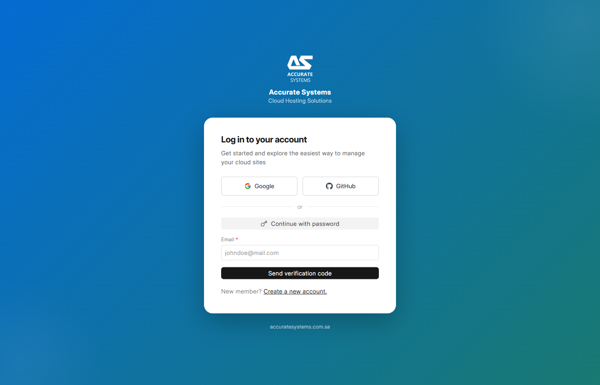
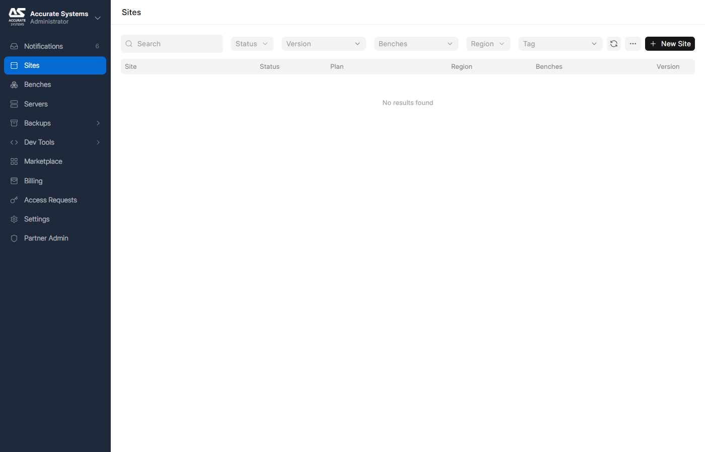

<div align="center">


# Accurate Systems Cloud Hosting Solutions

### White-Label Self-Hosted Cloud Platform

*Fork of [Frappe Press](https://github.com/frappe/press) — fully rebranded, Cloudflare-native, self-hosted ready*

[](https://github.com/accurate-systems/press/tree/cloudflare-dns)
[](https://github.com/frappe/press)
[](https://github.com/frappe/frappe)
[](LICENSE)

[Website](https://accuratesystems.com.sa) · [Dashboard](https://autodeploypanel.mvpstorm.com/dashboard/login) · [Demo](https://demo.sandbox.mvpstorm.com) · [Wiki](docs/wiki/README.md)

</div>

---

<div align="center">

<br/><sub><b>Branded Login</b> — Custom gradient, logo, Google & GitHub SSO</sub>
</div>

<br/>

<div align="center">

<br/><sub><b>Dashboard</b> — Dark sidebar, branded navigation, full server management</sub>
</div>

---

## What Is This?

This is a **production-ready white-label fork** of Frappe Press that transforms it into a fully branded, self-hosted cloud hosting platform. Deploy ERPNext and Frappe apps for your clients under **your own brand**.

### Why This Fork?

| Need | Upstream Press | This Fork |
|------|:---:|:---:|
| Your own brand & logo | No | **Yes** |
| Cloudflare DNS (not AWS) | No | **Yes** |
| Self-hosted on your servers | Partial | **Full** |
| No vendor lock-in | No | **Yes** |
| Standalone single-server mode | No | **Yes** |

---

## Features at a Glance

<table>
<tr>
<td width="50%">

### 🎨 Full White-Label Rebrand
- **~80 files** rebranded (Python + Vue)
- **~60 files** URL-replaced
- **30+ email templates** customized
- Custom colors, logo, login gradient
- Brand color: <code>#046BD2</code>

</td>
<td width="50%">

### 🌐 Cloudflare DNS Native
- Automatic A/AAAA record management
- Cloudflare API token per root domain
- Zone ID configuration per cluster
- Wildcard SSL via DNS-01 challenge
- No AWS dependency

</td>
</tr>
<tr>
<td>

### 🖥️ Self-Hosted Deployment
- Standalone single-server mode
- Hetzner (or any VPS) provisioning
- Local Docker registry
- Automated bench builds
- Demo landing page included

</td>
<td>

### 🔄 Upstream Sync Process
- Structured per-commit analysis
- Conflict risk assessment
- Sync journal tracking
- 2-week sync cadence
- Zero schema collisions

</td>
</tr>
</table>

---

## Architecture

```
                    ┌─── Cloudflare DNS ───┐
                    │  *.mvpstorm.com      │
                    │  A / AAAA records    │
                    │  Wildcard SSL        │
                    └──────┬───────────────┘
                           │
            ┌──────────────┼──────────────┐
            │              │              │
            ▼              │              ▼
┌───────────────────┐      │   ┌───────────────────┐
│  🔧 Controller    │      │   │  📦 App Server    │
│  (Server 1)       │◄─────┘   │  (Server 2)       │
│                   │  Agent   │                   │
│  • Press App      │────────►│  • Docker Engine   │
│  • Dashboard UI   │  API    │  • Bench Containers│
│  • Build Server   │         │  • MariaDB         │
│  • Docker Registry│         │  • Nginx Proxy     │
│  • Job Scheduler  │         │  • Redis           │
└───────────────────┘         └───────────────────┘
        │                              │
        │         ┌────────┐           │
        └────────►│ GitHub │◄──────────┘
                  │ (Apps) │
                  └────────┘
```

---

## Design Tokens

| Token | Value | Preview | Usage |
|-------|-------|---------|-------|
| Primary Blue | `#046BD2` |  | Buttons, links, active states |
| Primary Hover | `#045CB4` |  | Button hover |
| Dark Sidebar | `#1E293B` |  | Sidebar background |
| Teal Accent | `#197972` |  | Login gradient endpoint |
| Login Gradient | `#046BD2 → #197972` | | Background gradient |

---

## Quick Start

### Prerequisites

- Ubuntu 22.04 LTS (2 servers recommended, 4vCPU / 8GB RAM each)
- Domain on Cloudflare
- Cloudflare API token (Zone:Edit permission)

### Install

```bash
# 1. Install Frappe Bench
pip install frappe-bench
bench init frappe-bench --frappe-branch version-15
cd frappe-bench

# 2. Get this fork
bench get-app https://github.com/accurate-systems/press.git --branch cloudflare-dns

# 3. Create site
bench new-site cloud.yourdomain.com --install-app press

# 4. Configure (in Press UI)
#    - Add Cloudflare API token to Root Domain
#    - Set Zone ID in Cluster
#    - Create DNS records

# 5. Build & launch
bench build --app press
bench --site cloud.yourdomain.com migrate
sudo supervisorctl restart all
```

See the [full setup guide](docs/wiki/06-deployment-ops/server-provisioning.md) for detailed instructions.

---

## Fork-Specific Files

| File | What Changed |
|------|-------------|
| `press/utils/dns.py` | Cloudflare REST API (replaces AWS Route53) |
| `press/press/doctype/root_domain/root_domain.py` | Cloudflare API headers and calls |
| `press/press/doctype/root_domain/root_domain.json` | Added `cloudflare_api_token`, `cloudflare_zone_id` |
| `press/press/doctype/tls_certificate/tls_certificate.py` | `certbot dns-cloudflare` (replaces dns-route53) |
| `press/press/doctype/virtual_machine/virtual_machine.py` | Null guards for `vpc_id` / `security_group_id` |
| `press/press/doctype/server/server.py` | `ca_public_key` in unified server setup |
| `dashboard/src/assets/style.css` | Global brand overrides |
| `dashboard/src/components/AppSidebar*.vue` | Dark sidebar theme |
| `dashboard/src/pages/LoginBox.vue` | Branded login with gradient |

---

## Documentation

Full project documentation lives in the [Wiki](docs/wiki/README.md):

| Section | Content |
|---------|---------|
| [Overview](docs/wiki/00-getting-started/overview.md) | What this fork does, brand identity |
| [Architecture](docs/wiki/00-getting-started/architecture.md) | Servers, DNS, deploy flow |
| [Rebrand Guide](docs/wiki/02-frontend-development/rebrand-guide.md) | All changed files, design tokens |
| [UI Style Guide](docs/wiki/02-frontend-development/ui-style-guide.md) | Colors, typography, components |
| [Server Provisioning](docs/wiki/06-deployment-ops/server-provisioning.md) | Bootstrapping new servers |
| [Ops Toolkit](docs/wiki/06-deployment-ops/ops-toolkit.md) | Management scripts |

---

## Keeping in Sync with Upstream

This fork uses a structured sync process documented in [`SYNC_JOURNAL.md`](SYNC_JOURNAL.md):

- **Method**: Per-commit analysis with risk assessment before merging
- **Tracking**: Every decision (adopt/skip/adapt) is recorded with reasoning
- **Conflict pattern**: ~95% of changes are branding strings — conflicts are trivial
- **Frequency**: Every 2 weeks

```bash
# Sync workflow
git fetch origin develop
# Analyze upstream commits (use sync-fork skill or manual review)
# See SYNC_JOURNAL.md for the structured process
git rebase origin/develop
bench build --force --app press
bench --site your-site migrate
```

---

## Tech Stack

| Layer | Technology |
|-------|-----------|
| Backend | [Frappe Framework](https://github.com/frappe/frappe) v15 (Python) |
| Dashboard | [Frappe UI](https://github.com/frappe/frappe-ui) (Vue 3) |
| Containers | [Docker](https://www.docker.com) |
| Provisioning | [Ansible](https://www.ansible.com) |
| DNS | [Cloudflare API](https://developers.cloudflare.com/api/) |
| SSL | [Let's Encrypt](https://letsencrypt.org/) + DNS-01 challenge |
| Database | MariaDB 10.6+ |
| Agent | [Frappe Agent](https://github.com/frappe/agent) (Flask) |

---

## License

GNU Affero General Public License v3.0 — same as upstream. See [LICENSE](LICENSE).

---

<div align="center">

**Built by [Accurate Systems](https://accuratesystems.com.sa)**

<sub>Cloud Hosting Solutions — Deploy ERPNext under your own brand</sub>

</div>
