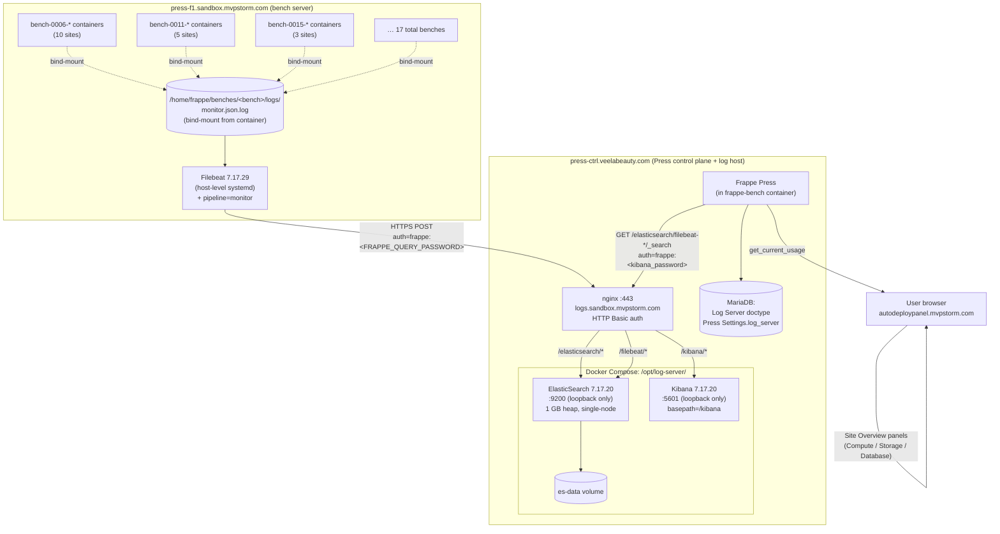
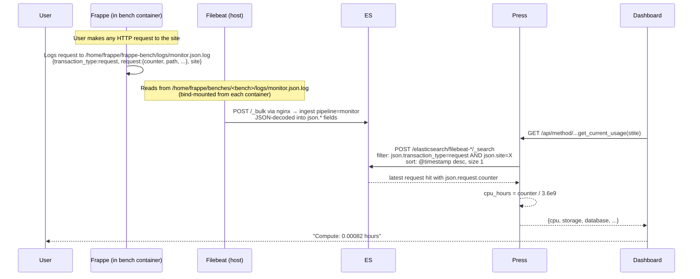
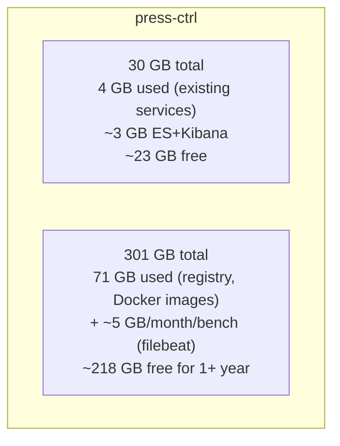

# Press Log Server Architecture (Self-Hosted on press-ctrl)

> Built 2026-04-29. See `docs/runbook/log-server.md` for ops procedures.

## High-level picture

## Data flow — what fills each panel

## Failure modes and what they look like to users

| Failure | What user sees | Diagnosis | Fix |
|---|---|---|---|
| ES down | "0 hours" | Press's `get_current_cpu_usage` catches all exceptions → returns 0 silently | Restart `/opt/log-server` stack |
| `kibana_password` drift between nginx and Log Server doc | "0 hours" | 401 from nginx, swallowed | Re-sync passwords |
| `monitor` ingest pipeline missing | filebeat retries every event with 404, no docs in `filebeat-*` | Check `/elasticsearch/_ingest/pipeline/monitor` | `PUT` from press repo's `playbooks/roles/filebeat_elasticsearch/files/monitor.json` |
| Filebeat ILM 405 through proxy | Filebeat won't ship anything | `journalctl -u filebeat` shows 405 errors | `setup.ilm.enabled: false` in filebeat.yml |
| Older Frappe (no `request.counter`) | "0 hours" only on some sites | ES has docs but counter field missing | Upgrade Frappe per-site (no log-side fix) |
| Bench logs not bind-mounted | filebeat reads but no real Frappe events | `docker inspect` doesn't show `/home/frappe/frappe-bench/logs` mount | Re-provision bench through Press (it'll add the mount) |

## Capacity assumptions

ES growth estimates:
- ~5 GB / month / active bench
- 17 benches → ~85 GB / month at full activity
- Realistic ~30 GB / month given typical traffic
- 6 months until disk pressure → set up index retention by then

## Security model

- ES + Kibana bound to **127.0.0.1** only on press-ctrl. Not reachable from internet.
- Public access only via nginx HTTPS with **HTTP Basic auth** (htpasswd).
- TLS via Let's Encrypt — auto-renewing daily 03:00 UTC via `/etc/cron.d/certbot`.
- Frappe `frappe` user (used by Press's queries + Filebeat ingest) has same password as the htpasswd entry — **must stay in sync** with `Log Server.kibana_password`.
- Kibana UI has its own `admin` user with its own password (separate htpasswd).
- ES `xpack.security` is **disabled** because authentication happens at nginx level. ES itself is open to anyone who can reach 127.0.0.1:9200 on press-ctrl — only press-ctrl root + the Docker network can.

## What's NOT included

- **Multi-node ES cluster** — single-node is fine until > 100 benches
- **Index Lifecycle Management** — manual deletion via cron until rollover policy is configured
- **Automated backups** — weekly volume snapshot is a manual ops task
- **Kibana custom dashboards** — Press doesn't use Kibana UI; we have it for ad-hoc debugging only
- **Alerting** — no Alertmanager or similar wired up
