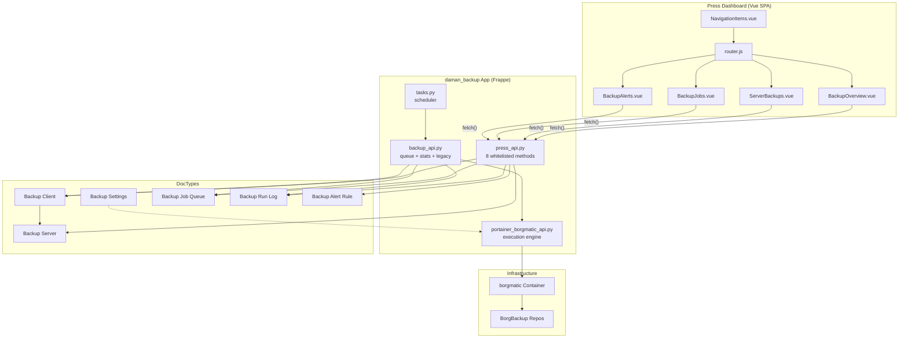

# File Reference Matrix

Complete map of all key files in the Accurate Systems Press fork, organized by layer. Covers the dashboard Vue SPA, backend patches, backup integration, and ops tooling.

Legend:
- `[PATCH]` -- Modified from upstream Press
- `[NEW]` -- Added by Accurate Systems (not in upstream)
- `[UPSTREAM]` -- Unmodified upstream file (listed for context)
- `~N lines` -- Approximate line count

Related: [Architecture](../00-getting-started/architecture.md) | [Rebrand Guide](../02-frontend-development/rebrand-guide.md) | [Deployment Guide](../06-deployment-ops/deployment-guide.md)

---

## Layer Index

1. [Dashboard Vue SPA](#1-dashboard-vue-spa)
2. [Backend Patches (Cloudflare DNS)](#2-backend-patches-cloudflare-dns)
3. [Backup Integration (daman_backup)](#3-backup-integration-daman_backup)
4. [Ops & Deployment](#4-ops--deployment)
5. [Rebrand Files](#5-rebrand-files)
6. [Cross-Layer Relationship Map](#6-cross-layer-relationship-map)

---

## 1. Dashboard Vue SPA

**Location**: `dashboard/src/`

### 1.1 Core App Files

| File | Type | Lines | Purpose |
|------|------|-------|---------|
| `App.vue` | [UPSTREAM] | -- | Root Vue component |
| `router.js` | [PATCH] | ~644 | Vue Router config -- added `/backups/*` routes |
| `index.html` | [PATCH] | -- | Entry HTML -- updated title/favicon |

### 1.2 Sidebar & Navigation

| File | Type | Lines | Purpose |
|------|------|-------|---------|
| `components/AppSidebar.vue` | [PATCH] | -- | Dark sidebar container, white logo, brand colors |
| `components/AppSidebarItem.vue` | [PATCH] | -- | Nav item with dark theme + active blue highlight |
| `components/AppSidebarItemGroup.vue` | [PATCH] | -- | Collapsible nav group (dark theme) |
| `components/NavigationItems.vue` | [PATCH] | ~267 | Nav menu definition -- added Backups section with 4 sub-items |

### 1.3 Auth & Login

| File | Type | Lines | Purpose |
|------|------|-------|---------|
| `components/auth/LoginBox.vue` | [PATCH] | -- | Login wrapper -- gradient bg, white logo |
| `components/auth/SaaSLoginBox.vue` | [PATCH] | -- | SaaS login variant -- same gradient treatment |
| `pages/LoginSignup.vue` | [PATCH] | -- | Login/signup form -- Google + GitHub social buttons |

### 1.4 Backup Dashboard Pages

| File | Type | Lines | Purpose |
|------|------|-------|---------|
| `pages/backups/BackupOverview.vue` | [NEW] | ~198 | Unified overview: server stats, job queue, client health, quick actions |
| `pages/backups/ServerBackups.vue` | [NEW] | ~167 | Server list with Run Backup / Check Health row actions |
| `pages/backups/BackupJobs.vue` | [NEW] | ~127 | Job queue list with Cancel / Retry row actions |
| `pages/backups/BackupAlerts.vue` | [NEW] | ~292 | Full CRUD: create/edit/toggle/delete alert rules via Dialog |
| `pages/backups/SiteBackups.vue` | [UPSTREAM] | ~165 | Per-site backup list (upstream Press feature) |
| `pages/backups/ServerSnapshots.vue` | [UPSTREAM] | ~210 | Server snapshot list (upstream Press feature) |

### 1.5 Styles & Assets

| File | Type | Lines | Purpose |
|------|------|-------|---------|
| `assets/style.css` | [PATCH] | -- | Global CSS overrides -- brand colors, form sizing, dark sidebar |
| `components/icons/FCLogo.vue` | [PATCH] | -- | SVG logo component (Accurate Systems logo) |

---

## 2. Backend Patches (Cloudflare DNS)

**Purpose**: Replace AWS Route53 DNS with Cloudflare API for domain management and TLS certificates.

| File | Type | Lines | What Changed |
|------|------|-------|-------------|
| `press/utils/dns.py` | [PATCH] | -- | Cloudflare REST API instead of AWS Route53 |
| `press/press/doctype/root_domain/root_domain.py` | [PATCH] | -- | Cloudflare headers and API calls |
| `press/press/doctype/root_domain/root_domain.json` | [PATCH] | -- | Added `cloudflare_api_token`, `cloudflare_zone_id` fields |
| `press/press/doctype/tls_certificate/tls_certificate.py` | [PATCH] | -- | `certbot dns-cloudflare` instead of `dns-route53` |
| `press/press/doctype/virtual_machine/virtual_machine.py` | [PATCH] | -- | Null guards for `vpc_id` and `security_group_id` |
| `press/press/doctype/server/server.py` | [PATCH] | -- | Pass `ca_public_key` in `_setup_unified_server()` |
| `press/playbooks/roles/user_ssh_certificate/tasks/main.yml` | [PATCH] | -- | Accept `ca_public_key` var instead of downloading from frappecloud.com |

---

## 3. Backup Integration (daman_backup)

**Location**: Separate Frappe app `daman_backup` -- installed on the same bench as Press. Dashboard pages live in the Press repo; backend API + DocTypes live in `daman_backup`.

### 3.1 Backend API (daman_backup app)

| File | Type | Lines | Purpose |
|------|------|-------|---------|
| `daman_backup/daman_backup/press_api.py` | [NEW] | ~237 | Press dashboard API: overview, client detail, alert CRUD (8 whitelisted methods) |
| `daman_backup/daman_backup/backup_api.py` | [NEW] | ~1149 | Unified backup API: queue-based async, stats, legacy execution |
| `daman_backup/daman_backup/portainer_borgmatic_api.py` | [NEW] | ~817 | Docker/Portainer execution engine: authenticate, execute, manage repos |
| `daman_backup/daman_backup/portainer_client.py` | [NEW] | ~65 | Portainer HTTP client wrapper |
| `daman_backup/daman_backup/parsers.py` | [NEW] | ~57 | borgmatic output parsers |
| `daman_backup/daman_backup/tasks.py` | [NEW] | ~931 | Scheduler tasks: trigger backups, cleanup, health checks |

### 3.2 DocTypes (daman_backup app)

| DocType | Type | Purpose | Roles |
|---------|------|---------|-------|
| `Backup Settings` | Single | Global config: execution mode, container name, Portainer creds | System Manager (RW) |
| `Backup Client` | Master | Client definition: what to back up, linked to Server | System Manager + Press Admin (RWCD) |
| `Backup Server` | Master | Server/repo definitions: SSH, storage, borgmatic config | System Manager + Press Admin (RWCD) |
| `Backup Job Queue` | Master | Async job execution queue: status, progress, logs | System Manager + Press Admin (RWCD) |
| `Backup Run Log` | Master | Execution history: timestamps, output, errors | System Manager (RWCD), Press Admin (R) |
| `Backup Alert Rule` | Master | Alert rules: type, frequency, recipients, thresholds | System Manager + Press Admin (RWCD) |
| `Backup Job` | Master | Scheduled job definitions | System Manager (RWCD) |
| `Backup Job Source Path` | Child | Source paths within a Backup Job | (child table) |
| `Server Assigned Client` | Child | Client assignments per server | (child table) |
| `Server Provider` | Master | Cloud provider definitions | System Manager (RWCD) |

### 3.3 Storage Handlers (daman_backup app)

| File | Type | Lines | Purpose |
|------|------|-------|---------|
| `daman_backup/daman_backup/utils/storage_factory.py` | [NEW] | -- | Factory pattern: returns correct handler based on storage type |
| `daman_backup/daman_backup/utils/oss_handler.py` | [NEW] | -- | Object Storage Service handler |
| `daman_backup/daman_backup/utils/ssh_handler.py` | [NEW] | -- | SSH/filesystem handler for remote repos |
| `daman_backup/daman_backup/utils/base_handler.py` | [NEW] | -- | Abstract base class for storage handlers |

### 3.4 Tests (daman_backup app)

| File | Type | Lines | Purpose |
|------|------|-------|---------|
| `daman_backup/daman_backup/tests/test_alert_crud.py` | [NEW] | ~178 | 12 tests for alert CRUD endpoints |
| `daman_backup/daman_backup/tests/test_press_api.py` | [NEW] | -- | Tests for press_api overview/detail endpoints |

---

## 4. Ops & Deployment

| File | Type | Lines | Purpose |
|------|------|-------|---------|
| `press/do_retry.py` | [NEW] | -- | Server bootstrap and verification toolkit (bench execute scripts) |
| `docs/wiki/06-deployment-ops/deployment-guide.md` | [NEW] | -- | New bench/server/domain checklists |
| `docs/wiki/06-deployment-ops/server-provisioning.md` | [NEW] | -- | Hetzner VM bootstrap guide (no private network) |
| `docs/wiki/06-deployment-ops/ops-toolkit.md` | [NEW] | -- | do_retry.py usage reference |
| `docs/wiki/06-deployment-ops/known-issues-and-fixes.md` | [NEW] | -- | Troubleshooting guide |
| `docs/wiki/06-deployment-ops/root-cause-patches.md` | [NEW] | -- | Patches applied to fix upstream issues |
| `docs/wiki/06-deployment-ops/scaling-guide.md` | [NEW] | -- | Scaling considerations for self-hosted |

---

## 5. Rebrand Files

~80 files rebranded, ~60 URL-replaced, 30+ email templates customized. Key categories:

| Category | Count | Example Files |
|----------|-------|--------------|
| Dashboard Vue components | ~20 | `AppSidebar.vue`, `LoginBox.vue`, `FCLogo.vue` |
| CSS / Style | ~5 | `style.css`, theme variables |
| Email templates | 30+ | `press/templates/emails/*.html` |
| Python brand strings | ~15 | Various `.py` files with company name/URL |
| Static assets | ~10 | Logo files, favicons, images |

See [Rebrand Guide](../02-frontend-development/rebrand-guide.md) for the complete list.

---

## 6. Cross-Layer Relationship Map

---

## File Count Summary

| Layer | New Files | Patched Files | Total |
|-------|-----------|---------------|-------|
| Dashboard Vue (backups) | 4 | 2 (router, nav) | 6 |
| Dashboard Vue (rebrand) | 1 (FCLogo) | ~20 | ~21 |
| Backend (Cloudflare DNS) | 0 | 7 | 7 |
| Backup API (daman_backup) | ~15 | 0 | ~15 |
| Backup DocTypes | 10 | 0 | 10 |
| Ops & Docs | ~8 | 0 | ~8 |
| **Total** | **~38** | **~29** | **~67** |
